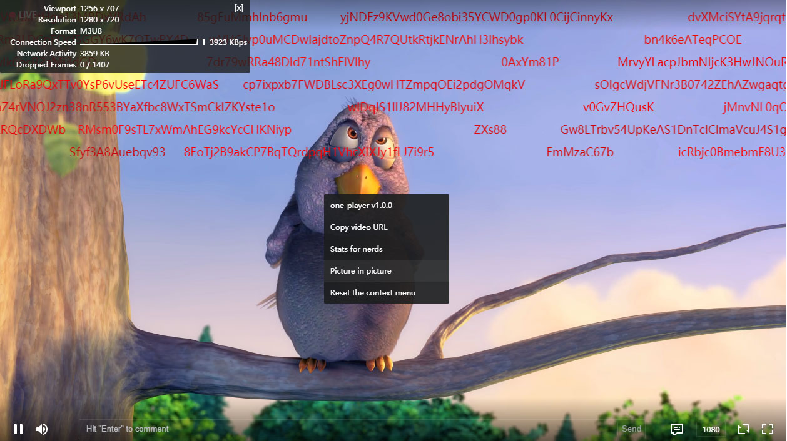

<h1 align="center"> one-player </h1>
<p align="center">
  <b>一款基于hls.js的h5播放器</b> <a href="https://www.npmjs.com/package/one-player"></a>
</p>

<p align="center">
  
</p>

## Install
```bash
$ yarn add one-player
```

## Usage

```javascript
import Hls from 'hls.js'
import OnePlayer from 'one-player'
const player = new OnePlayer({
  container: document.querySelector('#player'),
  autoPlay: true,
  canFull: false,
  live: true,
  reloadOnReplayInLiveMode: false,
  hls: {
    class: Hls,
    debug: false
  },
  quality: [
    {
      name: '自动',
      url: 'https://video-dev.github.io/streams/x36xhzz/x36xhzz.m3u8'
    },
    {
      name: '超清',
      url: 'http://dm8ibvx3p1j22.cloudfront.net/stream/live/WeLive-Ext-OL_13197510_9_159540/vod/play_1526793041741f.m3u8'
    },
    {
      name: '标清',
      url: 'http://dm8ibvx3p1j22.cloudfront.net/stream/live/WeLive-Ext-OL_13197510_9_159540/vod/play_1526793041741e.m3u8'
    }
  ],
  cover: 'http://s3.cn-north-1.amazonaws.com.cn/wlmedia/qa/live/WeLive-DEV_39070_109206_113374/picture/live_cover.jpg'
})
player.load('http://dm8ibvx3p1j22.cloudfront.net/stream/live/WeLive-Ext-OL_13197510_9_159540/vod/play_1526793041741e.m3u8')
player.on('play', () => {
  console.log('play')
})
player.on('pause', () => {
  console.log('pause')
})
```

## Config
完整查看[src/js/config.js](src/js/config.js)

## Events
事件监听返回的evt是一个标准的[CustomEvent](https://developer.mozilla.org/en-US/docs/Web/API/CustomEvent)对象
```
player.on(OnePlayer.EVENTS.VOLUME_CHANGE, (evt) => {
  console.log(evt, evt.detail)
})
```
同时支持[video events](https://developer.mozilla.org/en-US/docs/Web/Guide/Events/Media_events), [hls events](https://github.com/video-dev/hls.js/blob/master/docs/API.md#runtime-events)和以下自定义事件

完整查看[src/js/events.js](src/js/events.js)
```
{
  FULLSCREEN_CHANGE: 'iggfeFullscreenChange',
  VOLUME_CHANGE: 'iggfeVolumeChange',
  ...
}
```

## API
完整查看[src/js/player.js](src/js/player.js)
### load
```javascript
player.load(url) // 直接加载视频地址
player.load(3) // 加载quality[3].url
```

### switch
### destroy
```javascript
player.destroy()
```

## Plugin
### write
```javascript
import OnePlayer from 'one-player'
export default class Report extends OnePlayer.Plugin {
  constructor (player, opt = {}) {
    super(player)
    this.opt = opt
    this.init()
  }
  init () {
    let container = this.player.template.controlBar.querySelector('.one-player--control-right')
    let item = document.createElement('div')
    item.classList.add('one-player--control-item', 'player-add-report')
    item.innerHTML = `<button type="button">${this.opt.text}</button>`
    item.addEventListener('click', () => {
      window.alert('Reported!')
    })
    container.appendChild(item)
  }
}
```
### use
```javascript
import Report from 'player-add-report'
OnePlayer.use(Report, {
  text: 'Report'
})
```
